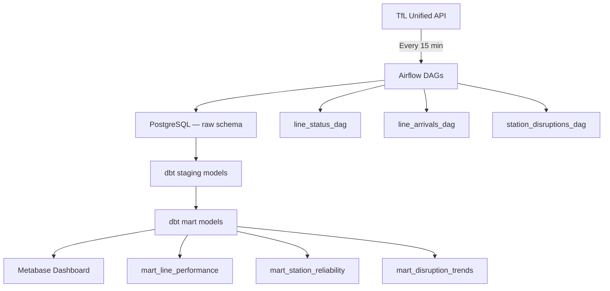
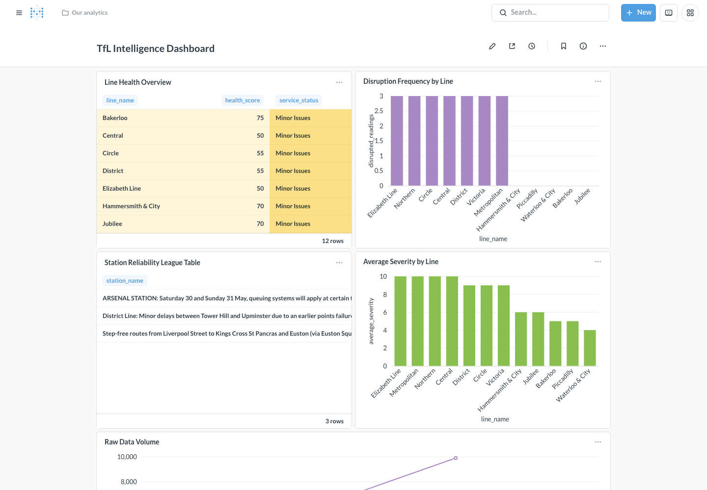

# TfL Intelligence Pipeline

[](https://github.com/sathiakhadija/TFL/actions/workflows/ci.yml)

**Production data engineering pipeline for London transit analytics**

> Portfolio project — BSc Data Science & Technology,
> Northumbria University London

TfL Intelligence Pipeline ingests live Transport for London data
every 15 minutes, transforms it through a three-layer dbt model
architecture, and surfaces reliability intelligence in a Metabase
dashboard — enabling pattern analysis that the raw TfL API cannot
provide.

---

## Architecture



---

## Dashboard Views



| View | Description |
|---|---|
| Line Health Overview | Current status all TfL lines, health scores 0-100 |
| Disruption Frequency | Disruptions per line last 7 days |
| Station Reliability League Table | League table — most to least reliable |
| Average Severity by Line | Average severity score by line |
| Raw Data Volume | Rows ingested by hour |

---

## dbt Model Architecture

Three-layer transformation pipeline:

| Layer | Materialization | Purpose |
|---|---|---|
| Raw | View | Direct reference to ingested data |
| Staging | View | Cleaned, typed, renamed columns |
| Marts | Table | Business logic, aggregations, KPIs |

dbt tests run on every ingestion:
not_null · unique · accepted_values · custom SQL tests

---

## Tech Stack

| Component | Technology |
|---|---|
| Orchestration | Apache Airflow 2.9 |
| Transformation | dbt Core 1.8 |
| Storage | PostgreSQL 15 |
| Visualisation | Metabase |
| Containerisation | Docker Compose |
| Language | Python 3.12 |
| CI/CD | GitHub Actions |
| Linting | ruff |
| Testing | pytest + responses |

---

## Local Setup

**Prerequisites:** Docker Desktop, Git, TfL API key

```bash
# 1. Clone
git clone https://github.com/sathiakhadija/TFL.git
cd TFL

# 2. Configure
cp .env.example .env
# Add TFL_API_KEY to .env

# 3. Start all services
docker compose up --build

# Airflow UI:  http://localhost:8080  (admin/admin)
# Metabase:    http://localhost:3000
# PostgreSQL:  localhost:5432
```

**Enable DAGs in Airflow:**
1. Open http://localhost:8080
2. Toggle on: line_status_ingestion,
   line_arrivals_ingestion,
   station_disruptions_ingestion
3. Data begins flowing within 15 minutes

**Connect Metabase to PostgreSQL:**
1. Open http://localhost:3000
2. Add database: PostgreSQL
3. Host: postgres, Port: 5432
4. Database: tfl_pipeline
5. User: tfl_user, Password: tfl_password

---

## Pipeline Validation

Each DAG includes validation tasks that check:
- Row count > 0 after every ingestion
- No null primary keys
- Severity values within expected range
- dbt tests pass before marts update

---

## Key Technical Decisions

**Why Airflow over cron or Prefect?**
Airflow provides task-level visibility, retry logic, XCom
for passing data between tasks, and a UI for monitoring
pipeline health. Cron provides none of these. Prefect is
excellent but less common in UK enterprise data teams.

**Why dbt over raw SQL transformations?**
dbt provides: version-controlled SQL, automatic lineage
diagrams, built-in testing framework, documentation
generation, and the ability to run transformations
incrementally. Raw SQL scripts provide none of these.

**Why PostgreSQL over SQLite?**
PostgreSQL handles concurrent writes from multiple Airflow
tasks, supports schemas for layer separation, and is the
production standard at every UK data organisation.
SQLite cannot handle concurrent writes.

**Why three dbt layers?**
Raw preserves the original API response unchanged — an
audit trail. Staging applies cleaning rules that can be
modified without touching raw data. Marts contain business
logic that non-engineers can understand and query directly.

---

## Author

Khadija Patwary — BSc Data Science & Technology,
Northumbria University London

[github.com/sathiakhadija](https://github.com/sathiakhadija)
